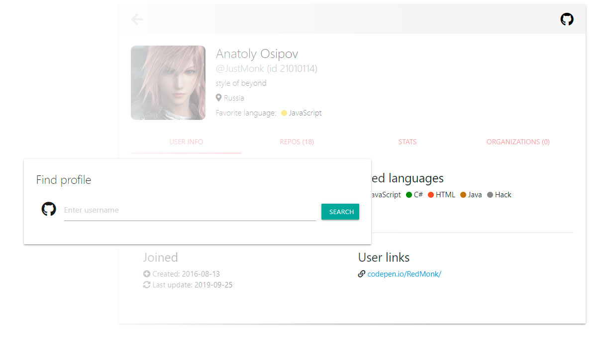

## Github profile card


Find extended user information by github v3 api

## Demo
https://justmonk.github.io/github-rest-profilecard/



## Dependences & Run
```
npm install

npm run dev

npm run build
```
